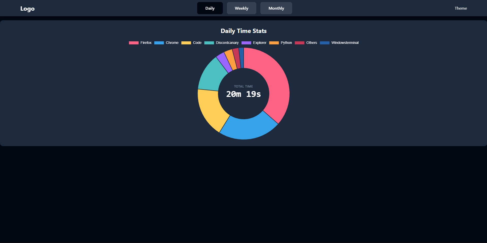
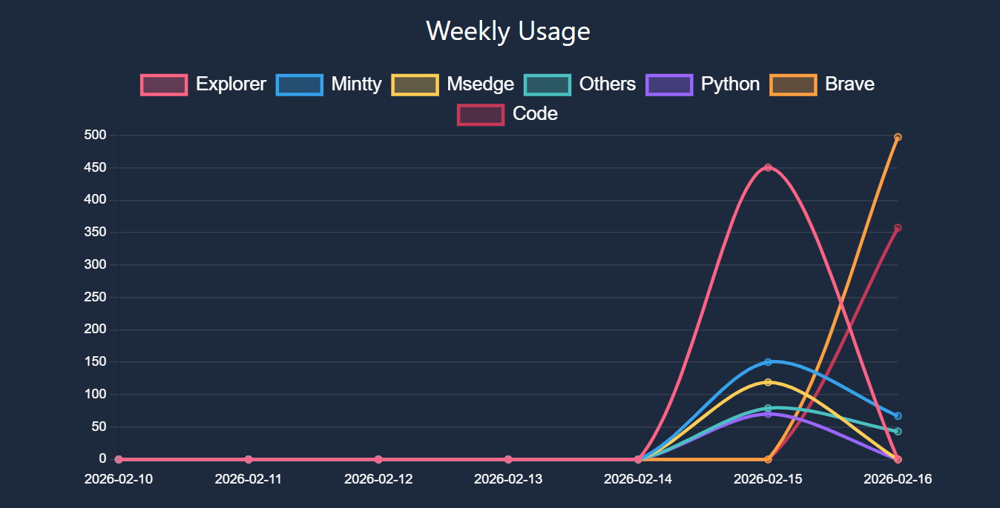
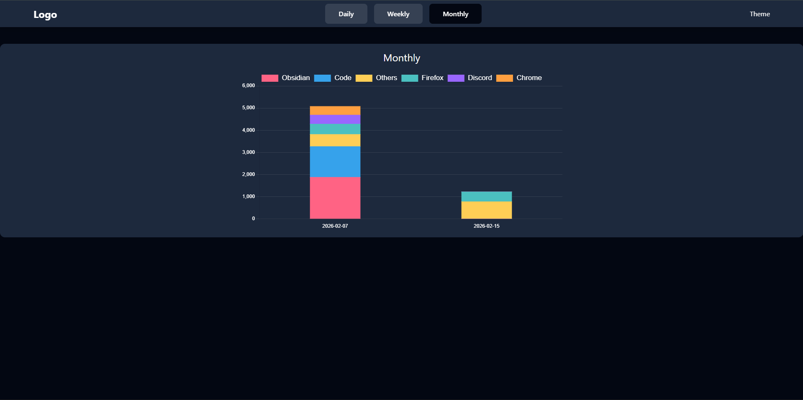

# Screen Time App
A desktop screen-time tracking application built with:

- PySide6 (Desktop App & System Tray)
- FastAPI (Backend API)
- React + Vite (Frontend Dashboard)
- Chart.js (Data Visualization)

The app tracks daily app usage and provides:
- Daily stats
- Weekly analytics
- Monthly summaries

---

## Features
- Real-time application usage tracking
- Daily usage breakdown
- Weekly usage trends (Line charts)
- Monthly summaries
- Also detects inactive time and handle's it smartly.

---

## Screenshots




---

## Structure
```
## Layered Architecture

+---------------------------+
|           User            |
+---------------------------+
              ↓
+---------------------------+
|   PySide6 Desktop Layer   |
|  - Window                 |
|  - System Tray            |
|  - Starts API Thread      |
+---------------------------+
              ↓
+---------------------------+
|      FastAPI Backend      |
|  - /api/daily             |
|  - /api/weekly            |
|  - /api/monthly           |
|  - Static file serving    |
|  - SPA fallback route     |
+---------------------------+
              ↓
+---------------------------+
|        React SPA          |
|  - Client-side routing    |
|  - Chart.js rendering     |
|  - fetch("/api/*") calls  |
+---------------------------+
              ↓
+---------------------------+
|     SQLite / Database     |
+---------------------------+

SPA* - Single Page Application
```

---

## Setup (Development)

#### 1. Clone repository
```
git clone https://github.com/yourusername/screen-time.git
cd screen-time
```

#### 2. Create virtual environment
```
python -m venv venv
venv\Scripts\activate
```

#### 3. Install backend dependencies
```
pip install -r requirements.txt
```

#### 4. Run backend
```
python -m gui.interface
```
### Frontend (Development Mode)
```
cd frontend
npm install
npm run dev
```

### Production Mode
```
cd frontend
npm run build
python -m gui.interface
```

